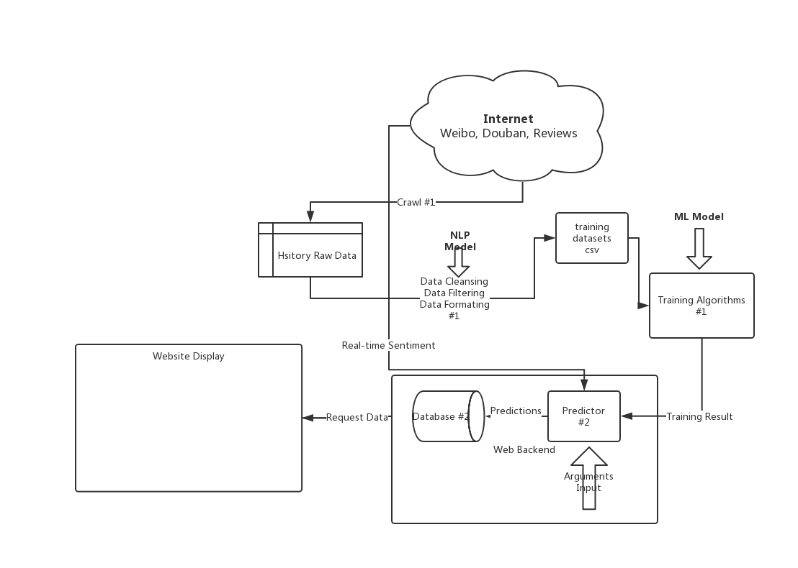

# Box Office Predictor
A project of box office predictor for EIE3280 in CUHKSZ.

## Reference

- [Prediction of Movie Success using Sentiment
Analysis of Tweets](http://www.jscse.com/papers/vol3.no3/vol3.no3.46.pdf)

- [Dynamic Box Office Forecasting Based on Microblog Data](https://www.jstor.org/stable/pdf/24899494.pdf?refreqid=excelsior%3Aa3a89bc298c2c0a9c141ce4b02f3cead)

## Baseline Structure 



## Predictor
Here we wanna train a predictor to predict the box office by using the data in the following:

Total BO | Director Average | Main Role i Average  | Sentiment Index | Movie Type
:-: | :-: | :-: | :-: | :-: 
int | int | int | float | vector |

### NLP tools
- [Awesome Chinese NLP](https://github.com/crownpku/Awesome-Chinese-NLP)
- [TextBlob](https://textblob.readthedocs.io/en/dev/)

## Plotly Dash Application
Here we wanna build a dash application for the visualization of the predictions.

## Steps to execute
```shell
# Enter the directory
cd box-office-predictor
# Install the env management tool pipenv
pip install pipenv
# Install dependencies
pipenv install
# Enter the virtual environment
pipenv shell
# Open the jupyter book
jupyter notebook
```
### How to install new pacakge?
```shell
pipenv install <package>
```

## Materials
- [Dash Tutorial](https://pythonprogramming.net/data-visualization-application-dash-python-tutorial-introduction/)
- [Dash Official Doc](https://dash.plot.ly/)
- [Python Machine Learning GitHub Repository](https://github.com/ageron/handson-ml)
